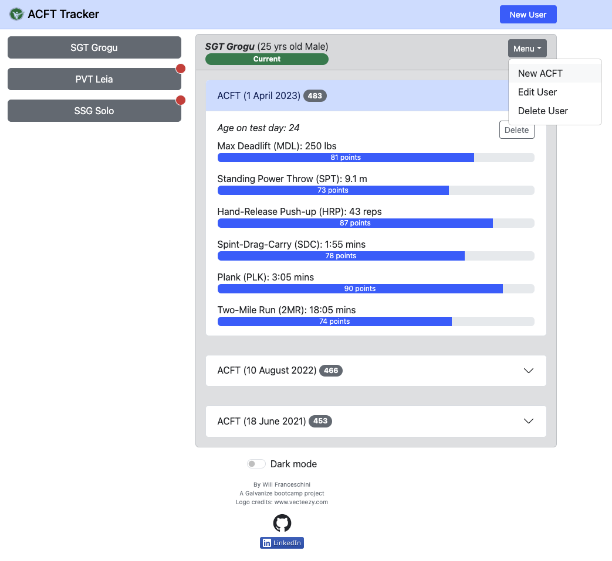

# MVP Fitness Tracker: Army Combat Fitness Test (ACFT)

### Screenshot

## Tech Stack

  
  
  
  
  
  
  

  
  
  
  

## Objectives & Minimum Requirements

- Build a Full-Stack minimum viable product (MVP) of a proposed web app
- Must implement full CRUD (create, read, update, delete) functionality to a database
- Must perform API requests

## Installation & Setup

- make sure Docker Desktop is installed and running on your machine
- click the green "code" button above, then click the 'copy' icon under HTTPS to copy the repo's URL
- on your terminal run `git clone <repo-URL>`
- `cd` into the `mvp-fitness-tracker` directory
- run `cp .env.template .env`
- run `docker-compose up -d --build`
- go to `localhost:3000` on your browser
- to power-down the app and delete all containers and associated volumes run `docker-compose down -v`
- (optional) to power-down the app and also delete its images run `docker-compose down -v --rmi all`

## Developer's Notes

- The most challenging aspect of this app was converting ACFT scoring tables only available in PDF into JSON data suitable for calculations
- I also developed my own `insertScoresToJson()` middleware to process raw scores submitted with a new ACFT test
- This particular app was initially developed within a week and demo to the class. I later refined it adding data validation and more functionality such as out of tolerance records tagging and UI improvements
- Finally, I containerized the entire application utilizing Nginx on the client, Node.js and Express.js on the server, and a PostgreSQL database

Watch a working demo of this project on my LinkedIn post below!

:point_right::point_right::point_right: [ACFT Tracker short video](https://www.linkedin.com/posts/will-franceschini_softwareengineering-javascript-bootstrap-activity-7057858977325355008-TW0Y?utm_source=share&utm_medium=member_desktop) :point_left::point_left::point_left:

## Visit the deployed demo

[ACFT Tracker demo](https://mvp_acft.tech-n-code.com/)
